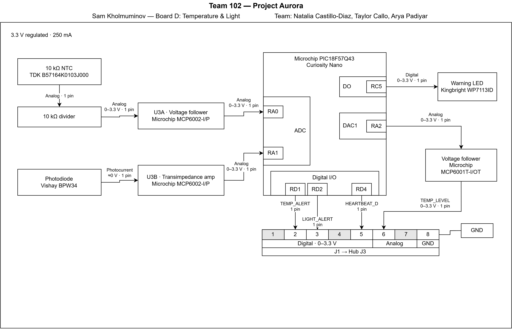

# Block Diagram

**Name:** Sam Kholmunov  
**Team:** Team 102 – Project Aurora  
**Subsystem:** Storage Environment

## My Role

I am responsible for the Storage Environment subsystem. This board monitors temperature and light conditions using a thermistor and photodiode. The signals are conditioned using an MCP6002 dual op-amp and processed by the PIC18F57Q43 Curiosity Nano.

## Block Diagram

